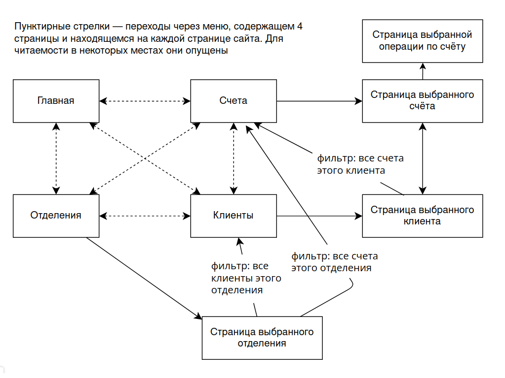
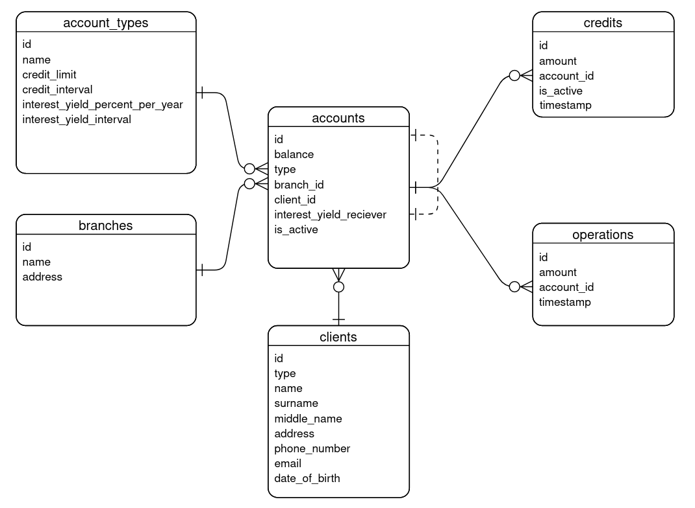

## Практикум: cистема управления информацией о клиентах банка и их счетах

ВМК, 6 семестр

### Описание страниц

На диаграмме представлен список страниц с возможными переходами между ними. На каждой странице есть одноуровневое меню, состоящее из четырёх ссылок: Главная, Клиенты, Счета, Отделения.

##### Главная

Общая информация о системе, текст с приветствием.

##### Клиенты

Список клиентов в виде таблицы. Выводится вся доступная информация о клиентах: 

- тип клиента (физическое или юридическое лицо)

- ФИО или название компании

- адрес

- номер телефона 

- электронная почта

- дата рождения, если это физ. лицо

- счета (кликабельно)

Доступна фильтрация по наличию конкретных типов счетов (чекбоксы), по суммарному балансу счетов клиента, по наличию операций на каком-либо из счетов в заданный промежуток времени. Содержит кнопку для введения нового клиента в систему. Можно производить поиск по подстроке среди всех полей.

##### Счета

Список счетов в виде таблицы. Все счета банка в рублях. Выводится вся доступная информация о счетах:

- баланс в рублях

- тип счёта

- отделение (кликабельно)

- клиент (кликабельно)

- процент на остаток (годовой. капитализация зависит от следующего пункта)

- интервал начисления процента на остаток

- номер счёта, на который начисляется процент, если он есть

- доступный кредит

- период кредитования

Доступна фильтрация по типам счетов, по наличию операций в определённом промежутке времени, по текущему балансу, по наличию операций в заданный промежуток времени. Содержит кнопку создания нового счёта. Можно производить поиск по подстроке среди всех полей.

##### Отделения

Список отделений в виде таблицы. Информация об отделении включает в себя его название, адрес, а также два кликабельных поля — "клиенты" и "счета", открывающие соответствующие страницы с фильтром на данное отделение. Содержит кнопку создания отделения. Можно производить поиск по подстроке среди всех полей.

##### Страница выбранного отделения

Содержит информацию о выбранном отделении. Содержит кнопку "Редактировать", которая делает поля изменяемыми и превращается в кнопку "Сохранить". Содержит кнопку "Удалить".

##### Страница выбранного клиента

Содержит информацию о выбранном клиенте. Содержит кнопку "Редактировать", которая делает поля изменяемыми и превращается в кнопку "Сохранить". Содержит кнопку "Удалить".

##### Страница выбранного счёта

Содержит информацию о выбранном счёте, в том числе все операции по нему. Содержит кнопку "Редактировать", которая делает поля изменяемыми и превращается в кнопку "сохранить". Содержит кнопку "добавить операцию", которая ведёт на страницу, описанной далее, где все поля пустые. Содержит кнопку закрытия счёта. Содержит кнопку "Удалить".
##### Страница выбранной операции

Содержит информацию о выбранной операции. Содержит кнопку "Редактировать", которая делает поля изменяемыми и превращается в кнопку "Сохранить". Содержит кнопку "Удалить".

### Некоторые сценарии использования

Данное веб-приложение предназначено для использования внутри хорошо защищённой локальной сети банка его сотрудниками. С помощью этого приложения сотрудник, например, может:

- получить список клиентов, в т.ч. отфильтровав по указанным выше критериям: Главная -> Клиенты -> (выбрать необходимые фильтры) -> Применить фильтры
- получить список счетов, в т.ч. отфильтровав по указанным выше критериям: Главная -> Счета -> (выбрать необходимые фильтры) -> Применить фильтры
- получить список отделений, в т.ч. отфильтровав по указанным выше критериям: Главная -> Отделения -> (выбрать необходимые фильтры) -> Применить фильтры
- получить информацию об отделении и изменить адрес: Главная -> Отделения -> Страница выбранного отделения -> Редактировать -> Сохранить
- изменить тип счёта клиента: Главная -> Клиенты -> Поиск клиента по имени -> Счета этого клиента ->  Выбранный счёт -> Редактировать -> Сохранить
- добавить клиента: Главная -> Клиенты -> Добавить клиента -> Сохранить
- удалить клиента: Главная -> Клиенты -> Выбранный клиент -> Удалить
- добавить отделение: Главная -> Отделения -> Добавить отделение -> Сохранить
- удалить отделение: Главная -> Отделения -> Выбранное отделение -> Удалить
- закрыть счёт клиента: Главная -> Клиенты -> Поиск клиента по имени -> Счета этого клиента ->  Выбранный счёт -> Закрыть счёт
- изменить начисление: Главная -> Счета -> Выбранный счёт -> Выбранная операция -> Редактировать -> Сохранить
- добавить начисление/списание: Главная -> Счета -> Выбранный счёт -> Добавить операцию -> Сохранить

### ERD

### Некоторые тонкости

Если для счёта доступно кредитование, то любой уход в минус после операции приводит к появлению кредита. Нужно за заданное количество дней выйти в
 плюс, тогда все кредиты закрываются. Лимит на кредит по объему превысить нельзя. Если не вернуть баланс выше нуля до конца беспроцентного периода, начнется начисление процентов с указанной периодичносью и размером процента.
